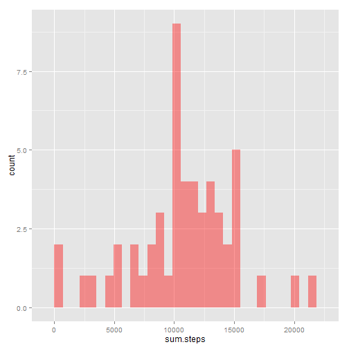
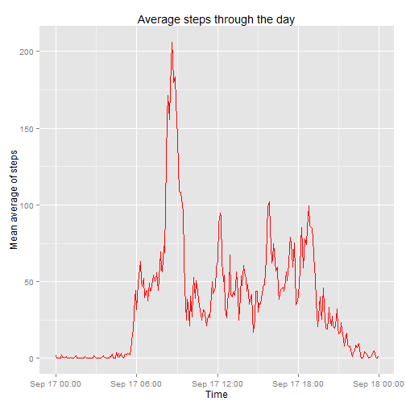
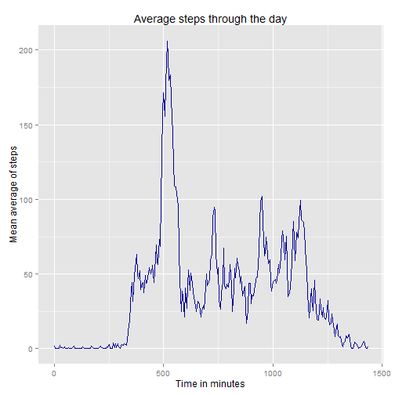
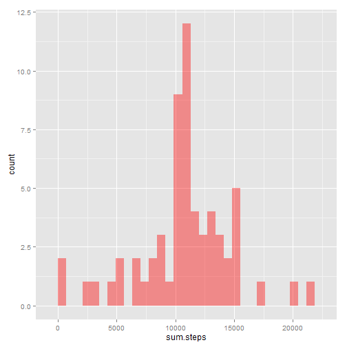
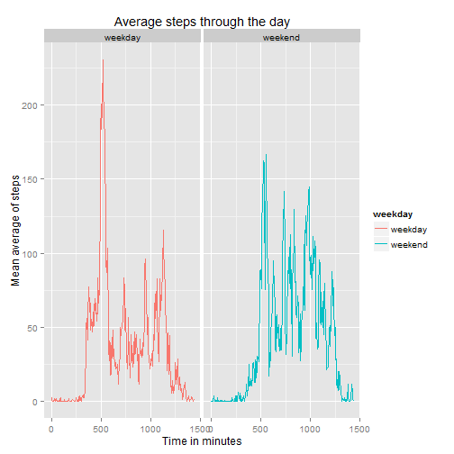

Reproducible Research Assignment
==============================

First download the data

Read the data into R Studio and view the summary of it.


```r
setwd("C:/Users/u6027576/Documents/Coursera/reproducibleResearch")
activity <- read.csv("activity.csv")
summary(activity)
```

```
##      steps                date          interval     
##  Min.   :  0.00   2012-10-01:  288   Min.   :   0.0  
##  1st Qu.:  0.00   2012-10-02:  288   1st Qu.: 588.8  
##  Median :  0.00   2012-10-03:  288   Median :1177.5  
##  Mean   : 37.38   2012-10-04:  288   Mean   :1177.5  
##  3rd Qu.: 12.00   2012-10-05:  288   3rd Qu.:1766.2  
##  Max.   :806.00   2012-10-06:  288   Max.   :2355.0  
##  NA's   :2304     (Other)   :15840
```

Remove the rows in the data frame where the number of steps is not given (NA) or just calculate the means of all.

What is mean total number of steps taken per day?
================================================

```r
activityNAR <- na.omit(activity)
## Sum
activitySum <- tapply(activity$steps, activity$date, sum)
df.actSum <- data.frame(date=names(activitySum), sum.steps=activitySum)
## Create histogram
library(ggplot2)
```

```
## Warning: package 'ggplot2' was built under R version 3.1.3
```

```r
ggplot(df.actSum,aes(x=sum.steps)) +
    geom_histogram(fill = "red", alpha = 0.4)
```

```
## stat_bin: binwidth defaulted to range/30. Use 'binwidth = x' to adjust this.
```

 

```r
## Mean
activityMeans <- tapply(activity$steps, activity$date, mean)
activityMin <- tapply(activity$steps, activity$date, min)
activityMax <- tapply(activity$steps, activity$date, max)
activityMedian <- tapply(activity$steps, activity$date, median)
df.actAv <- data.frame(mean.steps=activityMeans, min.steps=activityMin, max.steps=activityMax, median.steps=activityMedian)
df.actAv
```

```
##            mean.steps min.steps max.steps median.steps
## 2012-10-01         NA        NA        NA           NA
## 2012-10-02  0.4375000         0       117            0
## 2012-10-03 39.4166667         0       613            0
## 2012-10-04 42.0694444         0       547            0
## 2012-10-05 46.1597222         0       555            0
## 2012-10-06 53.5416667         0       526            0
## 2012-10-07 38.2465278         0       523            0
## 2012-10-08         NA        NA        NA           NA
## 2012-10-09 44.4826389         0       748            0
## 2012-10-10 34.3750000         0       413            0
## 2012-10-11 35.7777778         0       748            0
## 2012-10-12 60.3541667         0       802            0
## 2012-10-13 43.1458333         0       542            0
## 2012-10-14 52.4236111         0       540            0
## 2012-10-15 35.2048611         0       786            0
## 2012-10-16 52.3750000         0       758            0
## 2012-10-17 46.7083333         0       744            0
## 2012-10-18 34.9166667         0       759            0
## 2012-10-19 41.0729167         0       512            0
## 2012-10-20 36.0937500         0       532            0
## 2012-10-21 30.6284722         0       501            0
## 2012-10-22 46.7361111         0       783            0
## 2012-10-23 30.9652778         0       499            0
## 2012-10-24 29.0104167         0       533            0
## 2012-10-25  8.6527778         0       443            0
## 2012-10-26 23.5347222         0       440            0
## 2012-10-27 35.1354167         0       555            0
## 2012-10-28 39.7847222         0       533            0
## 2012-10-29 17.4236111         0       591            0
## 2012-10-30 34.0937500         0       523            0
## 2012-10-31 53.5208333         0       757            0
## 2012-11-01         NA        NA        NA           NA
## 2012-11-02 36.8055556         0       753            0
## 2012-11-03 36.7048611         0       533            0
## 2012-11-04         NA        NA        NA           NA
## 2012-11-05 36.2465278         0       785            0
## 2012-11-06 28.9375000         0       630            0
## 2012-11-07 44.7326389         0       766            0
## 2012-11-08 11.1770833         0       359            0
## 2012-11-09         NA        NA        NA           NA
## 2012-11-10         NA        NA        NA           NA
## 2012-11-11 43.7777778         0       540            0
## 2012-11-12 37.3784722         0       542            0
## 2012-11-13 25.4722222         0       444            0
## 2012-11-14         NA        NA        NA           NA
## 2012-11-15  0.1423611         0        33            0
## 2012-11-16 18.8923611         0       475            0
## 2012-11-17 49.7881944         0       753            0
## 2012-11-18 52.4652778         0       785            0
## 2012-11-19 30.6979167         0       789            0
## 2012-11-20 15.5277778         0       500            0
## 2012-11-21 44.3993056         0       758            0
## 2012-11-22 70.9270833         0       567            0
## 2012-11-23 73.5902778         0       760            0
## 2012-11-24 50.2708333         0       785            0
## 2012-11-25 41.0902778         0       551            0
## 2012-11-26 38.7569444         0       709            0
## 2012-11-27 47.3819444         0       806            0
## 2012-11-28 35.3576389         0       733            0
## 2012-11-29 24.4687500         0       568            0
## 2012-11-30         NA        NA        NA           NA
```

What is the average daily activity pattern?
===========================================


```r
activityNAR <- na.omit(activity)
TimeSeries <- tapply(activityNAR$steps, activityNAR$interval, mean)
df.timeSeries <- data.frame(Time=as.numeric(as.character(names(TimeSeries))), mean.steps=TimeSeries)
dtt <- sprintf("%04d", df.timeSeries$Time)
df.timeSeries$Time2 <- strptime(dtt, format="%H%M")

p <- ggplot() + 
  geom_line(data = df.timeSeries, aes(x = Time2, y = mean.steps, group=1), color="red") +labs(x = "Time", y = "Mean average of steps", title = "Average steps through the day")
p
```

 

```r
df.timeSeries$IntervalMinutes <- (df.timeSeries$Time %% 100) + (df.timeSeries$Time %/% 100)*60

q <- ggplot() + 
  geom_line(data = df.timeSeries, aes(x = IntervalMinutes, y = mean.steps, group=1), colour="#000099") +labs(x = "Time in minutes", y = "Mean average of steps", title = "Average steps through the day")
q
```

 


Which 5-minute interval contains the highest average for steps?


```r
maxStepAv <- max(df.timeSeries$mean.steps)
maxStepAvIndex <- grep(pattern=maxStepAv, df.timeSeries$mean.steps)
fiveMInterval <- df.timeSeries$Time[maxStepAvIndex]
fiveMInterval
```

```
## [1] 835
```

Imputing missing values
================================
Calculating rows containing NA. False values on complete cases are the rows which contain NA.


```r
table(complete.cases(activity))
```

```
## 
## FALSE  TRUE 
##  2304 15264
```

Filling in the blanks. Add bullet point explanation. All data is filled in now.


```r
intervals <- unique(activity$interval)
a <- which(is.na(activity$steps))

for (i in intervals){
  b <- which(activity$interval== i)
  empties <- intersect(a, b) 
  intervalPosition <- which(df.timeSeries$Time == i)
  intMean <- df.timeSeries$mean.steps[intervalPosition]
  activity$steps[empties] <- intMean
}
```

Complete cases is run again to show all cases are complete.


```r
A <- complete.cases(activity)
table(A)
```

```
## A
##  TRUE 
## 17568
```

Making the histograms with the new data


```r
activitySum <- tapply(activity$steps, activity$date, sum)
df.actSum <- data.frame(date=names(activitySum), sum.steps=activitySum)

##plot
library(ggplot2)
ggplot(df.actSum,aes(x=sum.steps)) +
    geom_histogram(fill = "red", alpha = 0.4)
```

```
## stat_bin: binwidth defaulted to range/30. Use 'binwidth = x' to adjust this.
```

 

```r
## Mean
activityMeans <- tapply(activity$steps, activity$date, mean)
activityMin <- tapply(activity$steps, activity$date, min)
activityMax <- tapply(activity$steps, activity$date, max)
activityMedian <- tapply(activity$steps, activity$date, median)
df.actAv <- data.frame(mean.steps=activityMeans, min.steps=activityMin, max.steps=activityMax, median.steps=activityMedian)
df.actAv
```

```
##            mean.steps min.steps max.steps median.steps
## 2012-10-01 37.3825996         0  206.1698     34.11321
## 2012-10-02  0.4375000         0  117.0000      0.00000
## 2012-10-03 39.4166667         0  613.0000      0.00000
## 2012-10-04 42.0694444         0  547.0000      0.00000
## 2012-10-05 46.1597222         0  555.0000      0.00000
## 2012-10-06 53.5416667         0  526.0000      0.00000
## 2012-10-07 38.2465278         0  523.0000      0.00000
## 2012-10-08 37.3825996         0  206.1698     34.11321
## 2012-10-09 44.4826389         0  748.0000      0.00000
## 2012-10-10 34.3750000         0  413.0000      0.00000
## 2012-10-11 35.7777778         0  748.0000      0.00000
## 2012-10-12 60.3541667         0  802.0000      0.00000
## 2012-10-13 43.1458333         0  542.0000      0.00000
## 2012-10-14 52.4236111         0  540.0000      0.00000
## 2012-10-15 35.2048611         0  786.0000      0.00000
## 2012-10-16 52.3750000         0  758.0000      0.00000
## 2012-10-17 46.7083333         0  744.0000      0.00000
## 2012-10-18 34.9166667         0  759.0000      0.00000
## 2012-10-19 41.0729167         0  512.0000      0.00000
## 2012-10-20 36.0937500         0  532.0000      0.00000
## 2012-10-21 30.6284722         0  501.0000      0.00000
## 2012-10-22 46.7361111         0  783.0000      0.00000
## 2012-10-23 30.9652778         0  499.0000      0.00000
## 2012-10-24 29.0104167         0  533.0000      0.00000
## 2012-10-25  8.6527778         0  443.0000      0.00000
## 2012-10-26 23.5347222         0  440.0000      0.00000
## 2012-10-27 35.1354167         0  555.0000      0.00000
## 2012-10-28 39.7847222         0  533.0000      0.00000
## 2012-10-29 17.4236111         0  591.0000      0.00000
## 2012-10-30 34.0937500         0  523.0000      0.00000
## 2012-10-31 53.5208333         0  757.0000      0.00000
## 2012-11-01 37.3825996         0  206.1698     34.11321
## 2012-11-02 36.8055556         0  753.0000      0.00000
## 2012-11-03 36.7048611         0  533.0000      0.00000
## 2012-11-04 37.3825996         0  206.1698     34.11321
## 2012-11-05 36.2465278         0  785.0000      0.00000
## 2012-11-06 28.9375000         0  630.0000      0.00000
## 2012-11-07 44.7326389         0  766.0000      0.00000
## 2012-11-08 11.1770833         0  359.0000      0.00000
## 2012-11-09 37.3825996         0  206.1698     34.11321
## 2012-11-10 37.3825996         0  206.1698     34.11321
## 2012-11-11 43.7777778         0  540.0000      0.00000
## 2012-11-12 37.3784722         0  542.0000      0.00000
## 2012-11-13 25.4722222         0  444.0000      0.00000
## 2012-11-14 37.3825996         0  206.1698     34.11321
## 2012-11-15  0.1423611         0   33.0000      0.00000
## 2012-11-16 18.8923611         0  475.0000      0.00000
## 2012-11-17 49.7881944         0  753.0000      0.00000
## 2012-11-18 52.4652778         0  785.0000      0.00000
## 2012-11-19 30.6979167         0  789.0000      0.00000
## 2012-11-20 15.5277778         0  500.0000      0.00000
## 2012-11-21 44.3993056         0  758.0000      0.00000
## 2012-11-22 70.9270833         0  567.0000      0.00000
## 2012-11-23 73.5902778         0  760.0000      0.00000
## 2012-11-24 50.2708333         0  785.0000      0.00000
## 2012-11-25 41.0902778         0  551.0000      0.00000
## 2012-11-26 38.7569444         0  709.0000      0.00000
## 2012-11-27 47.3819444         0  806.0000      0.00000
## 2012-11-28 35.3576389         0  733.0000      0.00000
## 2012-11-29 24.4687500         0  568.0000      0.00000
## 2012-11-30 37.3825996         0  206.1698     34.11321
```

Looking at the means and medians, the mean falls near enough the others but it is perhaps an overestimate. The approximate value for median is too high as it is 0 in all other cases.

Are there differences in activity patterns between weekdays and weekends?
========================================================================

When creating the column, Monday, Tuesday, Wednesday, Thursday, Friday are weekday and Saturday and Sunday are Weekends.


```r
activity$day <- weekdays(as.Date(activity$date, "%Y-%m-%d"))

weekend <- c('Saturday', 'Sunday')
activity$weekday <- factor((activity$day %in% weekend), levels=c(TRUE, FALSE), labels=c('weekend', 'weekday'))
```

To plot weekdays Vs. weekends


```r
DayEnd <- split(activity, activity$weekday)
weekendData <- data.frame(DayEnd[[1]])
weekdayData <- data.frame(DayEnd[[2]])
TimeSeries <- tapply(weekendData$steps, weekendData$interval, mean)
TimeSeries2 <- tapply(weekdayData$steps, weekdayData$interval, mean)

#weekend df
df.timeSeries <- data.frame(Time=as.numeric(as.character(names(TimeSeries))), mean.steps=TimeSeries, weekday="weekend")
df.timeSeries$IntervalMinutes <- (df.timeSeries$Time %% 100) + (df.timeSeries$Time %/% 100)*60

#weekday df
df.timeSeries2 <- data.frame(Time=as.numeric(as.character(names(TimeSeries2))), mean.steps=TimeSeries2, weekday="weekday")
df.timeSeries2$IntervalMinutes <- (df.timeSeries2$Time %% 100) + (df.timeSeries2$Time %/% 100)*60

df.full <- rbind(df.timeSeries2, df.timeSeries)

## q plot panel of weekend and weekday
qplot(IntervalMinutes, mean.steps, data=df.full, geom="line", color=weekday) + facet_grid(~weekday, scales='free', space='free') +labs(x = "Time in minutes", y = "Mean average of steps", title = "Average steps through the day")
```

 
